# Jigsawtiger

Jigsawtiger is a website for (my friend) the Glasgow music producer, singer and DJ, Jigsawtiger. The website was created in order to make her presence on the internet more outstanding and modern as her website that does not represent her talent at this point fully. The website is viewable [here](https://www.jigsawtiger.com/). 

My version of her site uses some of the same assets but aims to present them in a responsive way for all devices, and with a colour-scheme which is better for accessibility. The site aims to give information about Jigsawtiger to three distinct groups of users:

 - People who have just discovered Jigsawtiger and want to hear more of her music or find out more about her
 - Long-term fans of Jigsawtiger who want to quickly find her latest releases or DJ sets, and see when she is touring
 - Music promoters who would like to have a convenient way to get in touch with Jigsawtiger about booking her for a show.

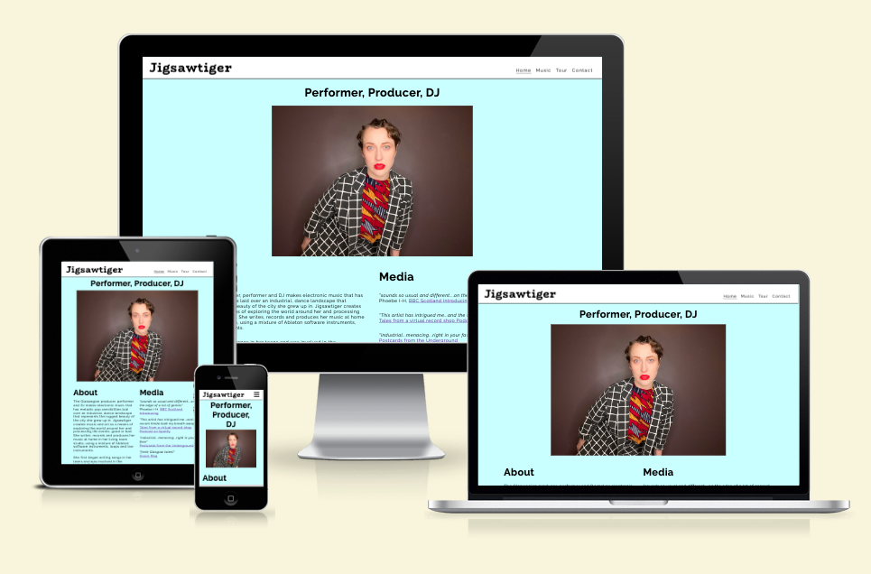

## Features 

### Existing Features

- __Navigation__

  - Featured on all pages of the, the full responsive navigation bar includes a logo on the left-hand side of the screen (this logo is also a link to the home page of the site), Home page link, Music page link, Tour page link and Contact page link. The navigation is always present on screen, and fully responsive with the links being collapsed into a toggle-able menu on devices below 768px.

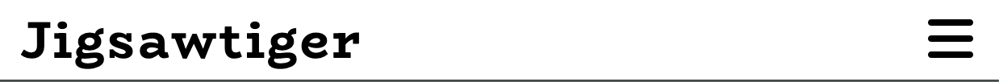

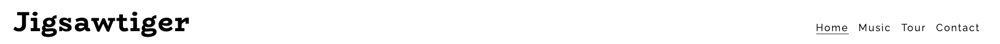

- __The home page__

  - The home page includes information about Jigsawtiger to allow users to find out more about the artist. At the bottom of the "about" section, there are links to keep the user journey going without requiring them to find the links in the nav bar. It also includes quotes from media outlets about Jigsawtiger.
  
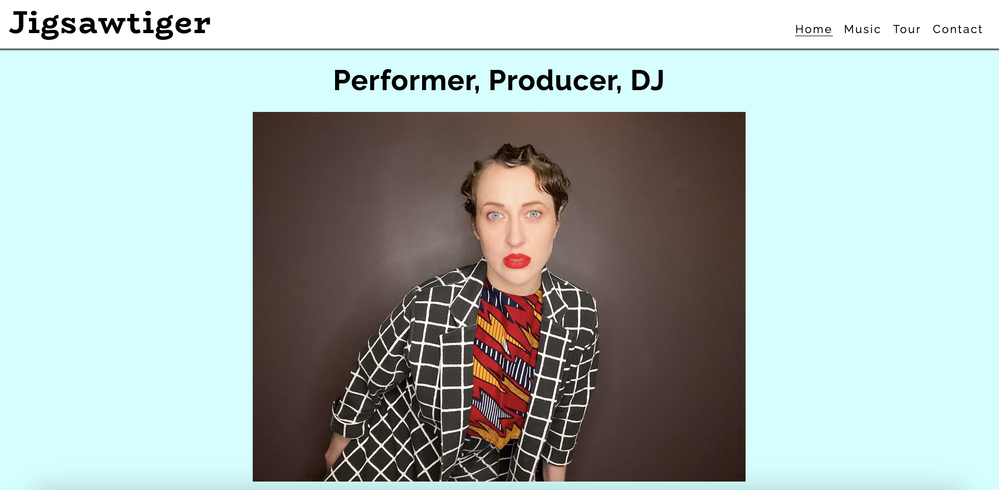

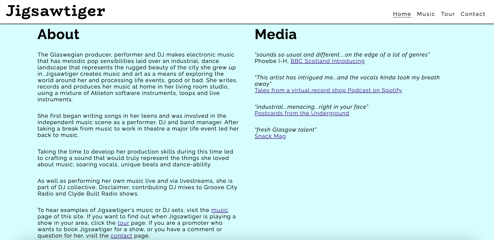

- __The music page__

  - The music page is split into two sections, one for displaying links and embedded media relating to music that Jigsawtiger has recorded or DJ sets she has uploaded, and one for embedded music videos and videos of DJ sets.
  - This section will help new users get an idea of what Jigsawtiger sounds like, and be a hub for existing fans to find all of her latest music. 

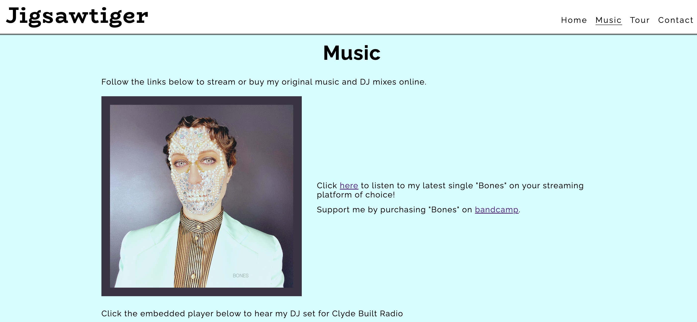

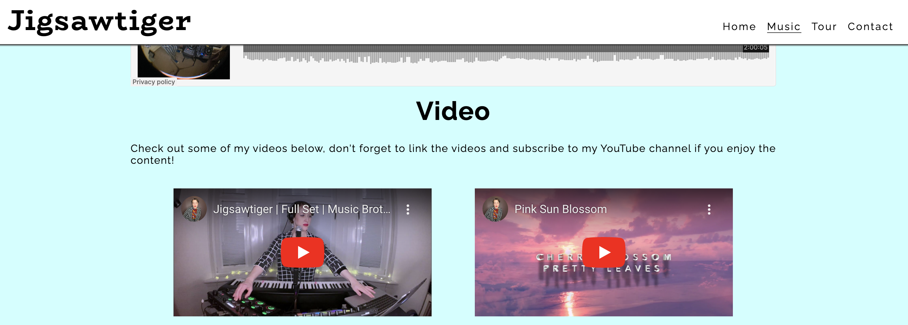

- __The tour page__

  - This section will allow users to find information about when and where Jigsawtiger is touring. Each tour date listing contains links to the venue to allow the user to buy tickets.
  - This section will be updated as and when more tours are announced, or when dates have passed.

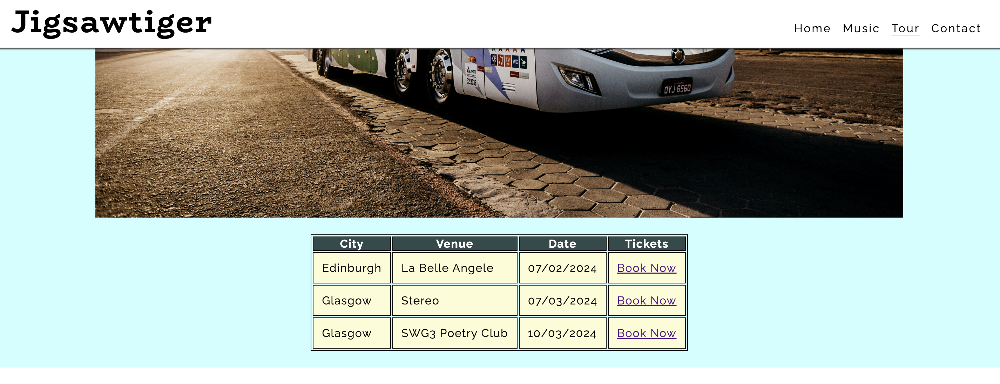

- __The contact page__ 

  - The contact page includes a form with 3 fields for users to send a message to Jigsawtiger. The name and email fields are required fields.
  - The top of the page features suggestions of instances/reasons why users might want to get in touch with Jigsawtiger.

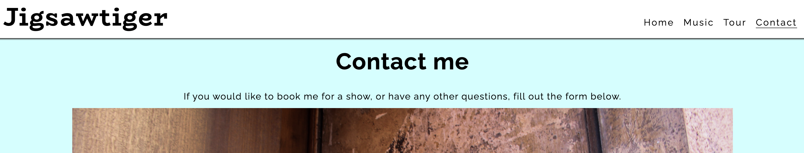

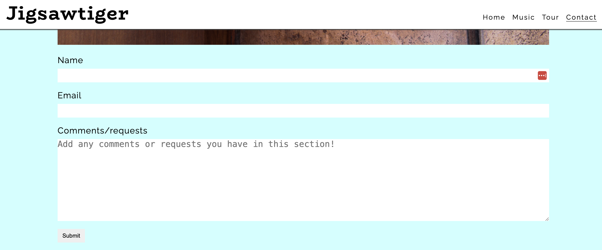

- __The response page__

  - Users are directed to a page reponse.html after submitting the form. The page displays a thank-you message acknowledging receipt of their enquiry, and a link back to the music page to continue interacting with the site.

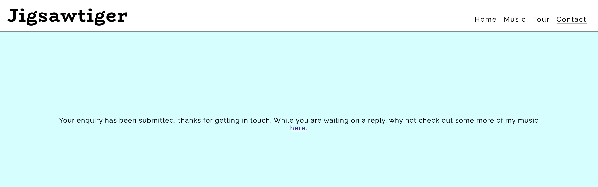

- __The Footer__

  - The footer section is uniform on every page, with relevant outbound links categorised into two sections, social profiles, and music. Each of the links opens up the target webpage in a new browser tab

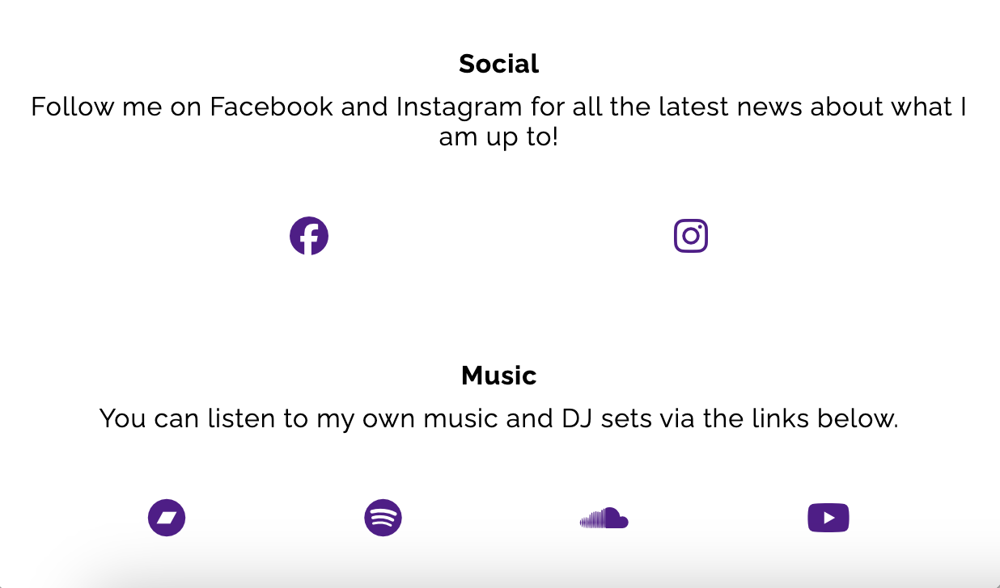

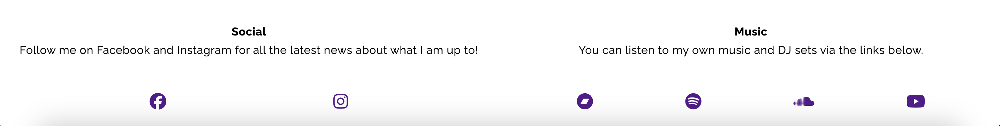

---
## Technologies Used

- [HTML](https://developer.mozilla.org/en-US/docs/Web/HTML) was used as the foundation of the site.
- [CSS](https://developer.mozilla.org/en-US/docs/Web/css) - was used to add the styles and layout of the site.
- [CSS Flexbox](https://developer.mozilla.org/en-US/docs/Learn/CSS/CSS_layout/Flexbox) - was used to arrange items symmetrically on the pages.
- [Balsamiq](https://balsamiq.com/) was used to make wireframes for the website, although the wireframes I initially designed had a different layout than the eventual website.
- [VSCode](https://code.visualstudio.com/) was used as the main tool to write and edit code.
- [Git](https://git-scm.com/) was used for the version control of the website.
- [GitHub](https://github.com/) was used to host the code of the website.
- [GitHub Pages](https://docs.github.com/en/pages/getting-started-with-github-pages/about-github-pages) was used to publish the code of the website.

---
## Design

### Color Scheme

- I chose a light blue color (rgba(204, 255, 255, 0.51)) as the main background color for the website so that it would be easier to make all of the links and embedded elements.

- For the tour table, I used a light yellow color (#FCFCD4) to stand out against the blue, but also be light enough so that the links would contrast well with the color. When I ran a lighthouse report this choice scored less than optimally for contrast, so I changed to (#4e4505)

- I used a medium green color (#319070) to make the media links stand out from the background

### Typography

- The 'Raleway', sans-serif Google Font was used as the main font of the website to make the pages as readable as possible.

- I used another Google Font on H1 elements, this time a serif called 'BioRhyme'.

### Features Left to Implement

- Fully functioning contact form which directs enquiries to an SQL database and generates email notifications

## Testing 

Information about testing, validation and bugs can be found in the link below

[Testing.md](TESTING.md)

## Deployment

### Deployment to Github pages:

The site was deployed to GitHub pages. The steps to deploy are as follows:
In the GitHub repository, navigate to the Settings tab
Select Pages in the side navigation bar
From the source section drop-down "Franch, select the Main Branch
Once the Main branch has been selected, hit "Save" and the page will be automatically refreshed with a detailed ribbon display to indicate the successful deployment.

The live link can be found here - https://rferguson386.github.io/jigsawtiger-rework/index.html

### Local Deployment
To make a local copy, use the following command in your terminal:
git clone https://github.com/rferguson386/jigsawtiger-rework.git

## Credits 

I took inspiration for the styles in the header section from the love running tutorial, but adapted the code for my project rather than copying it in completely.

My mentor Julia Konovalova gave lots of useful advice during my project, especially to make the nav section positioned absolutely so it always shows no matter how far the user scrolls down the page. She also helped me amend my original 2-column layout that I had planned during the wireframe phase of the project.

### Content 

- I used the website [Favicon generator](https://favicon.io/) to generate the logo and favicon for the site
- The text for the homepage and music page of the site were taken directly from the [original Jigsawtiger website](https://www.jigsawtiger.com/)
- The icons in the footer were taken from [Font Awesome](https://fontawesome.com/)

### Media

- The photos used on the home and sign up page are from [Unsplash](https://unsplash.com/)
- The images for the homepage and music page of the site were taken directly from the [original Jigsawtiger website](https://www.jigsawtiger.com/)

