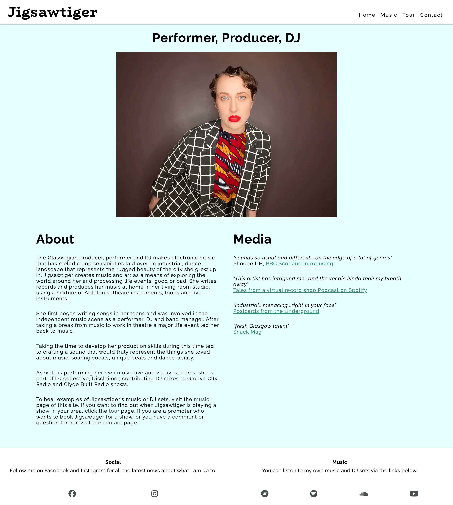

# TESTING

## Compatibility

In order to confirm the correct functionality and appearance of the site, it was tested on the following browsers: Chrome, Firefox and Safari. The links for each browser show the website is displaying correctly and all features described in the readme are present.

  + Chrome:

    - Homepage:

  

    - Music page:

  

    - Tour page:

  

    - Contact page:

  

  + FireFox:

    - Homepage:

  

    - Music page:

  

    - Tour page:

  

    - Contact page:

  

  + Safari:

    - Homepage:

  

    - Music page:

  

    - Tour page:

  

    - Contact page:

  

## Responsiveness

+ The website was checked for responsivenewss via the Responsive viewer chrome extension.

    - Main Page:

    

    - Music Page:

    

    - Tour Page:

    

    - Contact Page:

    

    - Response Page:

    
  

---
## Validator testing
+ ### HTML
  #### Home Page
    - No errors or warnings were found when passing through the official W3C validator.

    
    
  #### Music Page
    - No errors or warnings were found when passing through the official W3C validator.

    

  #### Tour Page
    - No errors or warnings were found when passing through the official W3C validator.

    

  #### Contact Page
    - No errors or warnings were found when passing through the official W3C validator.

    

    #### Response Page
    - No errors or warnings were found when passing through the official W3C validator.

    
    
+ ### CSS
  No errors or warnings were found when passing through the official W3C (Jigsaw) validator

  

+ ## LightHouse report

    - Using lighthouse in devtools I confirmed that the website is performing well, accessible and colors and fonts chosen are readable.
    
  ### Home page

  

  ### Music page

  

  ### Tour page

  

  ### Contact page

  

  ### Response page

  

---
​
## Bugs
+ ### Solved bugs
    1. The tour table was too large to have all of the information displayed on mobile devices
    
        *Solutions:* a css property of overflow-x: auto; was added to the container housing the table. I learned about this fix from a stack overflow question (https://stackoverflow.com/questions/1471210/handling-overflow-in-tables)

    2. The submit button on the contact form does not observe the spacing from the form that was shown on all other browsers tested
    
        *Solutions:* I added a firefox only CSS rule following the guidance in this thread (https://stackoverflow.com/questions/952861/targeting-only-firefox-with-css).

        This solution generated a warning in the CSS validator that the moz-appearance query is a vendor extension, but it still passed the validator with no errors.

    3. My text area box on the form was able to manipulated by the user, so I had to fix this so it was not expandable or contractable.

        *Solutions:* a css property of resize: none was added to text area element

   
    ---
+ ### Unsolved bugs
    - None
+ ### Mistakes
    - I used past simple tense in commit messages due to the habit when I just started working on this project.
    - While progressing in my code I learned to use present simple tense in commit messages.
    - I did not write the styles with mobile as the primary viewing method, but I styled with desktop first and had to implement media queries for smaller devices. If I was doing the project over again I would write the smalled device query styles as the main section of the CSS file, and have media queries only for changes to accommodate larger devices.

---